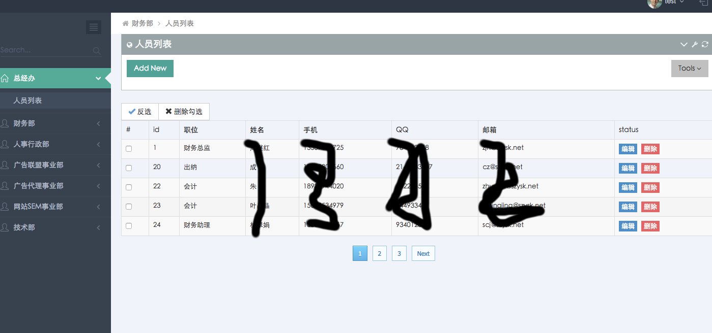
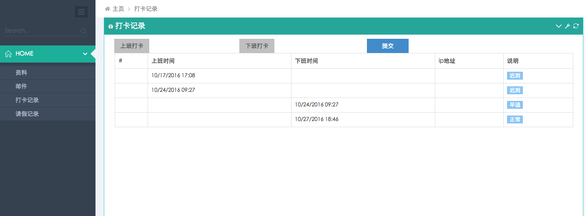
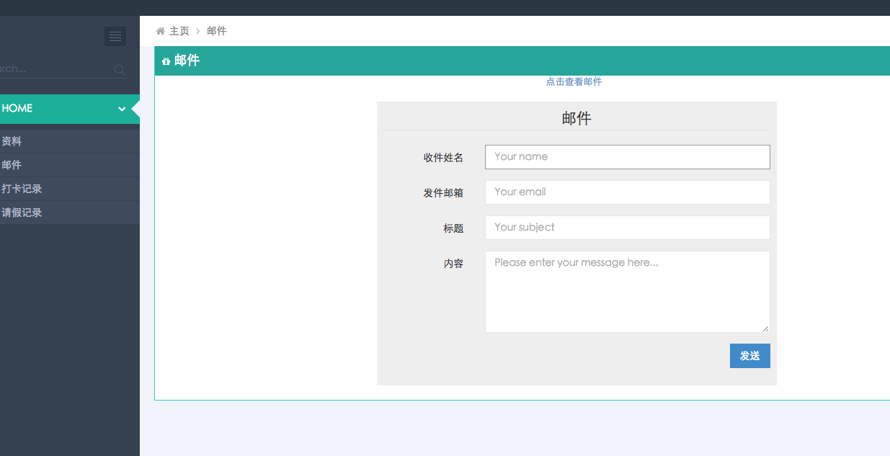
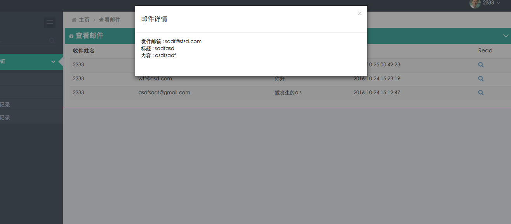
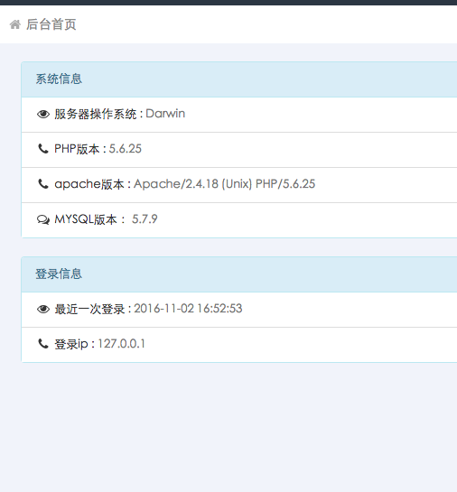

*   [项目说明](#yilai)
    *   [所使用到的技术](#predis)
*   [项目图示](#import)
    *   [如图](#1)

***

<h2 id="yilai">项目说明</h2>

<h3 id="predis">所使用到的技术</h3>
bootstrap,jquery,jquery日历插件，bootstrap-validate,zebra_pagination分页类，ci自带分页类，ajax,redis,socket.io即时邮件等。

<h2 id="import">项目图示</h2>

<h3 id="1">如图</h3>

